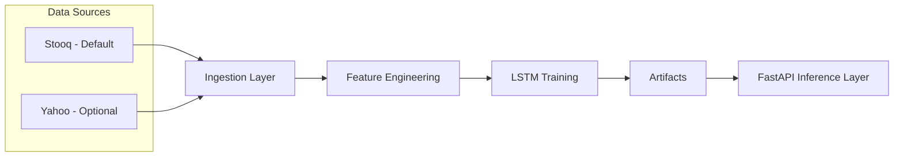
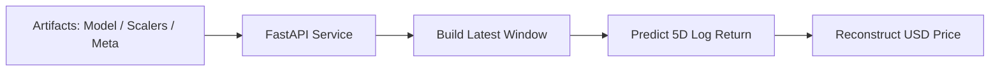

# NVDA LSTM Stock Forecast API
### Deep Learning Time-Series Forecasting with FastAPI + Docker

- LSTM-based recurrent neural network with a Dense regression head trained using TensorFlow/Keras

Production-ready deep learning time-series forecasting pipeline featuring:
- Robust market data ingestion (Stooq + Yahoo Finance fallback)
- Walk-forward evaluation with strong baselines
- Reproducible training artifacts
- Containerized FastAPI inference layer
- CPU and GPU Docker support

### What This Project Does

- Builds a deep learning pipeline for financial time-series forecasting
- Trains and evaluates an LSTM model using walk-forward splits
- Benchmarks performance against strong naive baselines
- Saves reproducible artifacts (model + scalers + metadata)
- Serves predictions via FastAPI (Swagger included)
- Supports reproducible deployment using Docker

---

## Tech Stack

- Python 3.12
- TensorFlow / Keras (LSTM)
- Pandas / NumPy / Scikit-learn
- Stooq + yfinance fallback (data ingestion)
- FastAPI + Uvicorn
- Docker (CPU + optional GPU)

---

## Architecture

### Training Pipeline


### Inference Pipeline

---

## Model Design

- Target: 5-day forward log-return (nvda_logret_5d)
- Loss: Mean Squared Error (MSE)
- Evaluation Metrics:
    - MAE / RMSE (log-return space)
    - MAPE (USD reconstructed space)
- Baselines:
    - Zero log-return (predict no change)
    - Persistence model (close(t+5) ≈ close(t))
- Validation: Walk-forward chronological splits (no leakage)

The API reconstructs the predicted USD price using:
```lua
close_hat(t+5) = close(t) * exp(predicted_logret_5d)
```

---

## Repository Structure

```text
lstm-nvda-api/
│
├── app/                      # API layer
│   ├── main.py               # FastAPI entrypoint
│   ├── schemas.py            # Pydantic models
│   └── service.py            # Model loading + inference logic
│
├── src/                      # ML pipeline
│   ├── data.py               # Data ingestion (Yahoo + Stooq fallback)
│   ├── features.py           # Feature engineering + scaling + windowing
│   └── train.py              # Training script (saves artifacts)
│
├── models/                   # Trained artifacts (Option A default)
│   ├── lstm_nvda.keras
│   ├── scaler_x.pkl
│   ├── scaler_y.pkl
│   └── meta.json
│
├── tests/                    # Smoke tests
├── notebooks/                # Experiments
│
├── Dockerfile.cpu
├── Dockerfile.gpu
├── .dockerignore
├── requirements.txt
├── requirements.cpu.txt
├── requirements.gpu.txt
├── README.md
└── LICENSE
```

---

## Quick Start (Local Development)

### 1. Create virtual environment

```bash
python3 -m venv .venv
source .venv/bin/activate
pip install -U pip
```

### 2. Install dependencies
```bash
pip install -r requirements.txt
```

### 3. Training the Model
```bash
python -m src.train
```

### 4. Expected outputs (saved artifacts)

- models/lstm_nvda.keras
- models/scaler_x.pkl
- models/scaler_y.pkl
- models/meta.json

* These artifacts are required by the API.

---

## Running the API (Local)

```bash
uvicorn app.main:app --reload --host 0.0.0.0 --port 8000
```

- Health Check:
```bash
curl http://localhost:8000/health
```

- Prediction:
```bash
curl "http://localhost:8000/predict?symbol=NVDA&start=2024-01-01"
```

🔎 Swagger UI: [http://localhost:8000/docs](http://localhost:8000/docs)

---

## Docker Deployment

## Option A (Default – Pretrained Artifacts Included)

The repository includes the trained artifacts inside models/.
You can run the API immediately without retraining.

### CPU Version (Portable)

Build:
```bash
docker build -f Dockerfile.cpu -t nvda-lstm-api:cpu .
```

Run:
```bash
docker run --rm -p 8000:8000 nvda-lstm-api:cpu
```

### GPU Version (Optional)

Requires NVIDIA Container Toolkit.

Build:
```bash
docker build -f Dockerfile.gpu -t nvda-lstm-api:gpu .
```

Run:
```bash
docker run --rm --gpus all -p 8000:8000 nvda-lstm-api:gpu
```

Verify GPU:
```bash
docker exec -it <container_name> python -c "import tensorflow as tf; print(tf.config.list_physical_devices('GPU'))"
```

## Option B (Enterprise Blueprint – External Artifacts)

- For production environments:
    - Store artifacts externally (S3, GCS, mounted volume)
    - Load via configurable MODELS_DIR
    - Separate training pipeline (CI/CD)
    - Promote versioned artifacts to production

---

## Benchmarks

| Model                | Target space |      MAE |     RMSE | MAPE (USD) |
| -------------------- | -----------: | -------: | -------: | ---------: |
| Zero log-return      |       logret | 0.021025 | 0.030083 |          — |
| LSTM                 |       logret | 0.021566 | 0.030674 |          — |
| Persistence price    |    USD close |   3.1058 |   4.2072 |    2.1056% |
| LSTM (reconstructed) |    USD close |   3.1709 |   4.2683 |    2.1517% |

Time-series forecasting is inherently difficult.
Strong naive baselines often perform competitively.

This repository documents a reproducible deep learning workflow ready for iterative improvement.

---

## License
This project is licensed under the MIT License.
