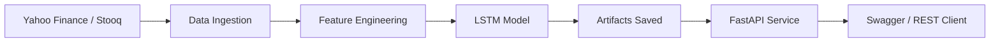

```markdown


```

# NVDA LSTM Stock Forecast API
### NVDA Long Short Term Memory (LSTM) Stock Forecast API (FastAPI + Docker)

- LSTM-based RNN with Dense regression head trained with TensorFlow/Keras

Deep learning time-series forecasting pipeline using LSTM (TensorFlow/Keras),
with robust data ingestion, reproducible training artifacts, and a production-ready
FastAPI inference layer containerized with Docker.

- Build a deep learning pipeline for time series forecasting
- Train and evaluate an LSTM model with clear metrics (MAE/RMSE/MAPE)
- Save artifacts (model + scalers + metadata)
- Serve predictions via FastAPI with Swagger docs
- Containerize the API using Docker for reproducible deployment

---

## Tech Stack
- Python 3.12 (WSL)
- TensorFlow / Keras (LSTM)
- Pandas / NumPy / Scikit-learn
- yfinance + Stooq fallback (data ingestion)
- FastAPI + Uvicorn
- Docker

---

## Architecture



---

## Model Design

- Target: next-day log-return prediction
- Loss: Mean Squared Error (MSE)
- Metrics: MAE, RMSE (log-return space), MAPE (USD space)
- Baseline 1: Zero log-return
- Baseline 2: Persistence price model
- Chronological train/validation/test split

---

## Repository Structure

```text
lstm-nvda-api/
│
├── app/                      # API layer
│   ├── main.py               # FastAPI entrypoint
│   ├── schemas.py            # Pydantic models
│   └── service.py            # Model loading + inference logic
│
├── src/                      # ML pipeline
│   ├── data.py               # Data ingestion (Yahoo + Stooq fallback)
│   ├── features.py           # Feature engineering + scaling + windowing
│   └── train.py              # Training script (saves artifacts)
│
├── models/                   # Trained artifacts
│   ├── lstm_nvda.keras
│   ├── scaler_x.pkl
│   ├── scaler_y.pkl
│   └── meta.json
│
├── tests/                    # Smoke tests / validation
├── notebooks/                # Experiments / exploration
│
├── Dockerfile
├── requirements.txt
├── README.md
└── LICENSE
```

---

## Quick Start

### 1. Environment Setup

Create and activate virtualenv:
```bash
python3 -m venv .venv
source .venv/bin/activate
pip install -U pip
```

### 2. Install dependencies
```bash
pip install -r requirements.txt
```

### 4. Install yfinance lib
```bash
pip install -U yfinance
```

## Training the Model

### 1. Run training
```bash
python -m src.train
```

### 2. Expected outputs (saved artifacts)

After training completes, you should have:

- models/lstm_nvda.keras
- models/scaler_x.pkl
- models/scaler_y.pkl
- models/meta.json

## Running API

```bash
uvicorn app.main:app --reload --host 0.0.0.0 --port 8000
```

🔎 Swagger UI: [http://localhost:8000/docs](http://localhost:8000/docs)

## Docker

```bash
docker build -t lstm-nvda-api .
docker run -p 8000:8000 lstm-nvda-api
```

## Notes

- Yahoo Finance sometimes fails inside certain networks/environments. This project includes a Stooq fallback to ensure reproducibility.
- Training and evaluation follow time-series best practices (chronological splits).

## Steps

- WSL + Docker setup
- Data ingestion with fallback
- Feature engineering + windowing
- LSTM training + artifacts
- Improve metrics reporting (USD space + baseline comparison)
- FastAPI inference service + Swagger
- Dockerfile + container test

---

## Common Issues

### 1. Yahoo Finance failing (YFTzMissingError / timezone error)

```bash
YFTzMissingError('$%ticker%: possibly delisted; no timezone found')
```

Yahoo Finance occasionally fails due to:
- Network restrictions
- Rate limiting
- Invalid JSON response
- Corporate firewall filtering

This project includes a fallback to **Stooq**.
If Yahoo fails, the system automatically attempts to download data from Stooq.

If both fail:
- Check internet access inside WSL
- Try pinging external domains:
```bash
  ping google.com
```
### 2. TensorFlow CUDA/cuDNN/GPU warnings

```bash
Could not find cuda drivers on your machine, GPU will not be used.
Unable to register cuDNN factory
```

TensorFlow was installed with GPU support, but CUDA drivers are not available.
Impact: None. The model runs normally on CPU.

If you want to silence logs add this before running training:
```bash
export TF_CPP_MIN_LOG_LEVEL=2
```

### 3. Docker permission denied inside WSL

If docker run fails with permission errors:
```bash
sudo usermod -aG docker $USER
```
Then close and reopen the WSL terminal.

### 4. Model metrics seem high (MAPE > 20%)

Time series forecasting is inherently difficult. Always compare model performance against a simple baseline (persistence model).

If the model does not outperform baseline:

- Increase lookback window
- Adjust LSTM architecture
- Try predicting returns instead of raw price

---

## License
This project is licensed under the MIT License.
