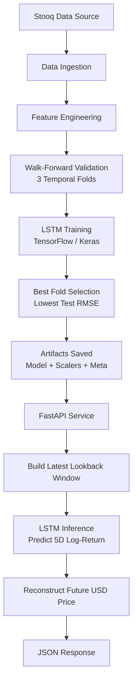

# NVDA LSTM Stock Forecast API
### Deep Learning Time-Series Forecasting with FastAPI + Docker

- LSTM-based recurrent neural network with a Dense regression head trained using TensorFlow/Keras

* Local Deployment

This project implements an LSTM-based time series forecasting pipeline to predict the 5-day forward log-return of NVDA and reconstruct the future USD closing price.

The system includes:
- Walk-forward model training
- Baseline comparisons
- Artifact versioning
- End-to-end inference smoke tests
- FastAPI service layer
- CPU and GPU Docker deployments

### What This Project Does

- Builds a deep learning pipeline for financial time-series forecasting
- Trains and evaluates an LSTM model using walk-forward splits
- Benchmarks performance against strong naive baselines
- Saves reproducible artifacts (model + scalers + metadata)
- Serves predictions via FastAPI (Swagger included)
- Supports reproducible deployment using Docker

---

## Tech Stack

- Python 3.12
- TensorFlow / Keras (LSTM)
- Pandas / NumPy / Scikit-learn
- Stooq (data ingestion)
- FastAPI + Uvicorn
- Docker (CPU + optional GPU)

---

## Quick Start (Local Development)

### 1. Create virtual environment

```bash
python3 -m venv .venv
source .venv/bin/activate
pip install -U pip
```

### 2. Install dependencies
```bash
pip install -r requirements.txt
```

### 3. Training the Model
```bash
python -m src.train
```

### 4. Expected outputs (saved artifacts)

- models/lstm_nvda.keras
- models/scaler_x.pkl
- models/scaler_y.pkl
- models/meta.json

These artifacts are required by the API.

---

## Running the API (Local)

```bash
uvicorn app.main:app --reload --host 0.0.0.0 --port 8000
```

- Health Check:
```bash
curl http://localhost:8000/health
```

- Runtime Check:
```bash
curl http://localhost:8000/runtime
```

- Prediction:
```bash
curl "http://localhost:8000/predict?symbol=NVDA&start=2024-01-01"
```

🔎 Swagger UI: [http://localhost:8000/docs](http://localhost:8000/docs)

---

## Docker Deployment

The repository includes the trained artifacts inside models/.
You can run the API immediately without retraining.

### CPU Version (Portable)

Build:
```bash
docker build -f Dockerfile.cpu -t nvda-lstm-api:cpu .
```

Run:
```bash
docker run --rm -p 8000:8000 nvda-lstm-api:cpu
```

Inference Smoke Test:
```bash
docker exec -it <container_name> python -m tests.smoke_test_service
```

### GPU Version

Requires NVIDIA Container Toolkit.
```bash
nvidia-smi
```

Build:
```bash
docker build -f Dockerfile.gpu -t nvda-lstm-api:gpu .
```

Run:
```bash
docker run --rm --gpus all -p 8000:8000 nvda-lstm-api:gpu
```

Verify GPU:
```bash
docker exec -it <container_name> python -c "import tensorflow as tf; print(tf.config.list_physical_devices('GPU'))"
```

Inference Smoke Test:
```bash
docker exec -it <container_name> python -m tests.smoke_test_service --use-gpu
```

---

## Architecture

The following diagram illustrates the complete end-to-end architecture, from data ingestion and walk-forward training to artifact versioning and API inference.


---

## Repository Structure

```text
lstm-nvda-api/
│
├── app/                      # API layer
│   ├── main.py               # FastAPI entrypoint
│   └── service.py            # Model loading + inference logic
│
├── src/                      # ML pipeline
│   ├── data.py               # Data ingestion (Stooq)
│   ├── features.py           # Feature engineering + scaling + windowing
│   ├── train.py              # Training script (saves artifacts)
│   └── utils.py              # Utility helpers
│
├── models/                   # Trained artifacts
│   ├── lstm_nvda.keras
│   ├── scaler_x.pkl
│   ├── scaler_y.pkl
│   └── meta.json
│
├── tests/
│   └── smoke_test_service.py
│
├── Dockerfile.cpu
├── Dockerfile.gpu
├── .dockerignore
├── requirements.txt
├── requirements.cpu.txt
├── requirements.gpu.txt
├── README.md
└── LICENSE
```

---

## Problem Definition

Target:
```lua
nvda_logret_5d
```

Which represents:
```lua
log(close(t+5)) - log(close(t))
```

Reconstruction formula used by the API:
```lua
close_hat(t+5) = close(t) * exp(predicted_logret_5d)
```

---

### Data

Primary symbol:
- NVDA

Exogenous features:
- SOXX
- MU
- QQQ

Data source:
- Stooq

### Model Architecture

- LSTM network
- Lookback window: 60 timesteps
- Loss: Mean Squared Error
- Optimizer: Adam
- Output: 5-day forward log-return

### Validation Strategy

Walk-forward chronological splits (3 folds):
- Temporal integrity preserved
- No leakage
- Best fold selected by lowest test RMSE (log-return space)
Best fold in this run: Fold 3

### Metrics

Log-return space:
- MAE ≈ 0.061
- RMSE ≈ 0.076

Price reconstruction space:
- MAE ≈ 5.94 USD
- RMSE ≈ 7.53 USD
- MAPE ≈ 5.86%

Baselines:
- Zero log-return baseline
- Persistence price baseline

### Model Design

- Target: 5-day forward log-return (nvda_logret_5d)
- Loss: Mean Squared Error (MSE)
- Evaluation Metrics:
    - MAE / RMSE (log-return space)
    - MAPE (USD reconstructed space)
- Baselines:
    - Zero log-return (predict no change)
    - Persistence model (close(t+5) ≈ close(t))
- Validation: Walk-forward chronological splits (no leakage)

The API reconstructs the predicted USD price using:
```lua
close_hat(t+5) = close(t) * exp(predicted_logret_5d)
```

Although the model is trained to predict 5-day forward log-return, the API returns the reconstructed 5-day ahead closing price in USD, satisfying the stock closing price forecasting requirement.

### Forecast Horizon

This model predicts 5 trading days ahead.
- Target: nvda_logret_5d
- Forecast horizon: 5 days
- Reconstruction:
```text
close_hat(t+5) = close(t) * exp(logret_5d_hat)
```

### Why log-return instead of price?

- Stabilizes variance
- Improves training convergence
- Reduces scale sensitivity
- Reconstructed to USD at inference time

---

## Results (Walk-forward, 3 folds)

- Target: nvda_logret_5d (5-day forward log-return), with price reconstructed as
```lua
close_hat(t+5) = close(t) * exp(logret_5d_hat)
```
- Best fold (selected by lowest test RMSE in log-return space): Fold 3

Per-fold performance (log-return space):

- Fold 1: MAE 0.0825, RMSE 0.1006
```text
Baseline (zero log-return): MAE 0.0526, RMSE 0.0678
```

- Fold 2: MAE 0.0646, RMSE 0.0807
```text
Baseline (zero log-return): MAE 0.0610, RMSE 0.0767
```

- Fold 3: MAE 0.0359, RMSE 0.0475
```text
Baseline (zero log-return): MAE 0.0340, RMSE 0.0445
```

Aggregate across folds (mean ± std):
- Log-return: MAE 0.0610 ± 0.0192, RMSE 0.0762 ± 0.0219
- USD reconstructed price: MAE 5.94 ± 1.70, RMSE 7.53 ± 2.13, MAPE 5.86% ± 1.77%

Note: financial forecasting is noisy and naive baselines are often competitive. The goal here is a reproducible end-to-end deep learning pipeline with honest time-series validation and deployable inference.

---

## Roadmap

This project establishes a reproducible deep learning pipeline for financial time-series forecasting. The next iterations focus on improving realism, robustness and production maturity.

1) Uncertainty-Aware Forecasting

Current model outputs a single point estimate. Future versions may include:
- Probabilistic forecasting (prediction intervals)
    - MC Dropout (approximate Bayesian uncertainty)
    - Quantile regression (P10 / P50 / P90 outputs)
- API returning confidence bands instead of a single deterministic value

This is especially important in financial forecasting, where uncertainty is as relevant as the prediction itself.


2) Continuous Temporal Evaluation

- Walk-forward continuous evaluation (rolling window instead of fixed folds)
- Rolling retraining (e.g., monthly or quarterly)
- Regime-aware validation across different volatility periods
- Drift detection to trigger automated retraining

This would simulate real production conditions more closely.


3) Strategy-Level Backtesting

Current evaluation focuses on error metrics (MAE / RMSE / MAPE).
Next step is evaluating financial impact.

- Backtest a simple trading strategy using model outputs
- Compare against:
    - Buy & Hold
    - Zero-return baseline
    - Persistence baseline

This shifts evaluation from prediction accuracy to decision quality.


4) Risk & Performance Metrics

Add finance-specific metrics:
- Sharpe ratio (risk-adjusted return)
- Maximum drawdown
- Volatility
- CAGR (compound annual growth rate)
- Win rate

These metrics reflect deployability in real financial systems.


5) MLOps & Production Hardening

- Model registry (MLflow)
- CI/CD pipeline for retraining and artifact promotion
- Automated scheduled retraining jobs
- Experiment tracking and version comparison

---

## License
This project is licensed under the MIT License.
